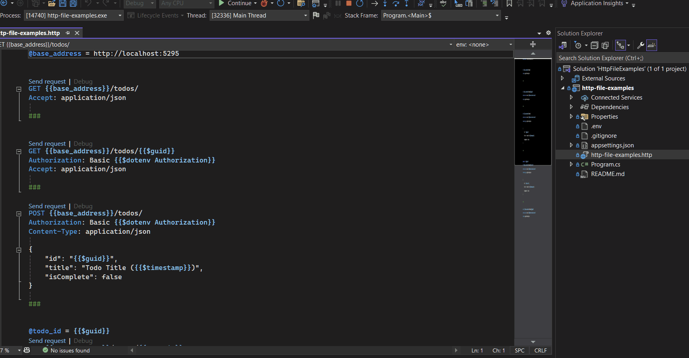

# HTTP File Examples

This is an example project showcasing HTTP file examples. 

The `.http` file [http-file-examples.http](http-file-examples.http) consists of GET, POST, PUT & DELETE requests based off the exposed endpoints from the mock todo minimal api. 

A `.env` file has also been included to demonstrate it's usage.

> **_NOTE:_**  `.env` should not be committed to source control if containing sensitive information 

# Get Stared

Start the API

```
dotnet run 
```

Use the `.http` file either in visual studio or vscode using the [REST Client](https://marketplace.visualstudio.com/items?itemName=humao.rest-client) extension.

